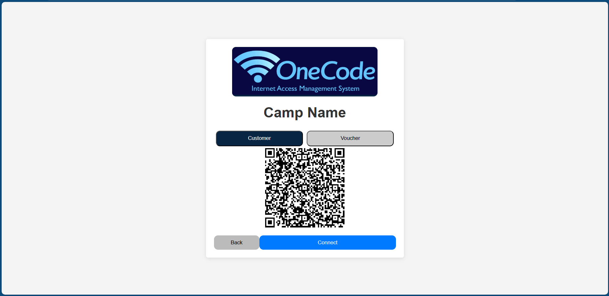
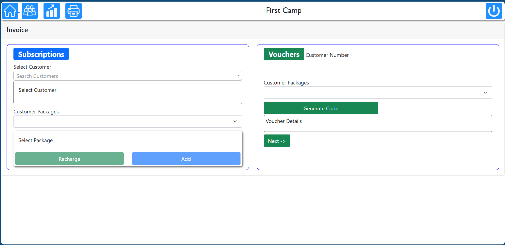
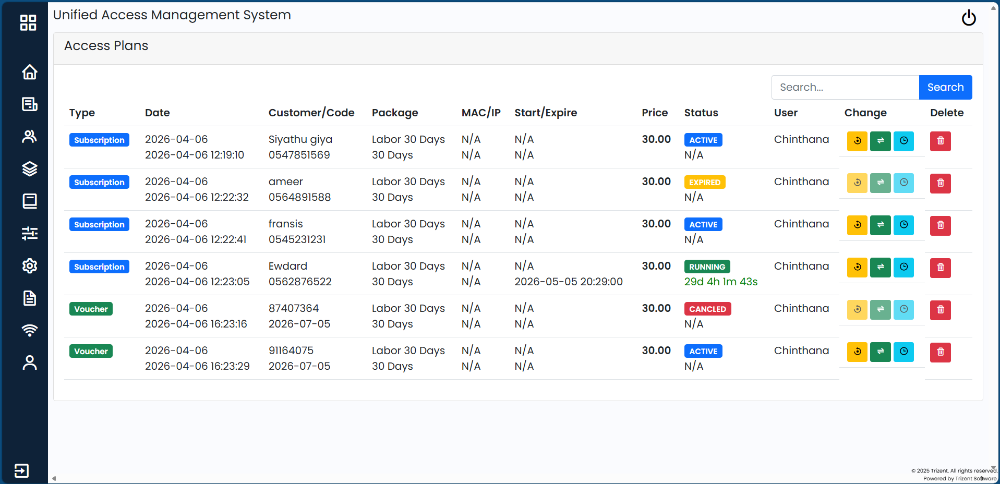
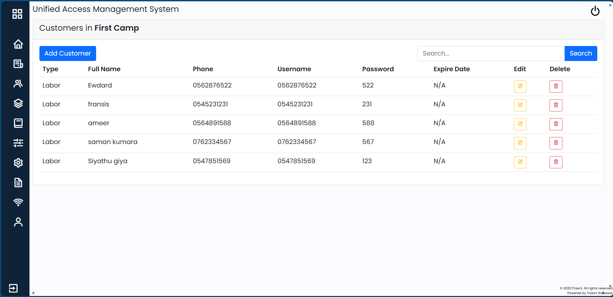
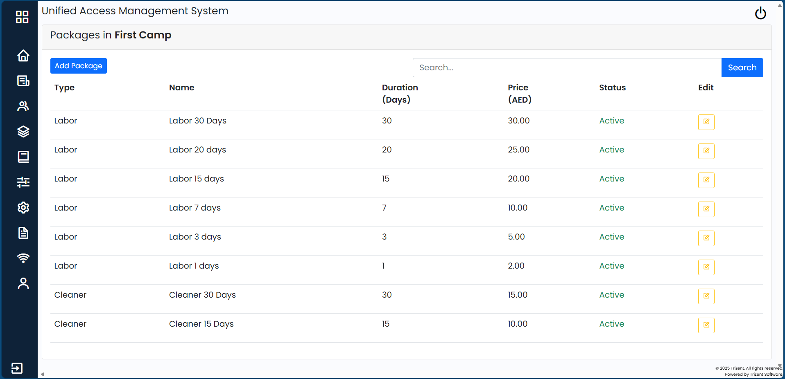
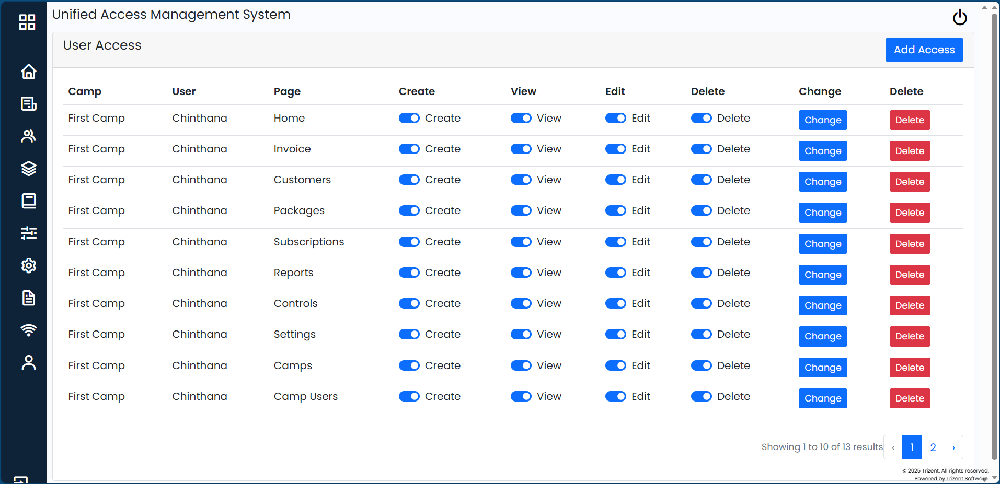
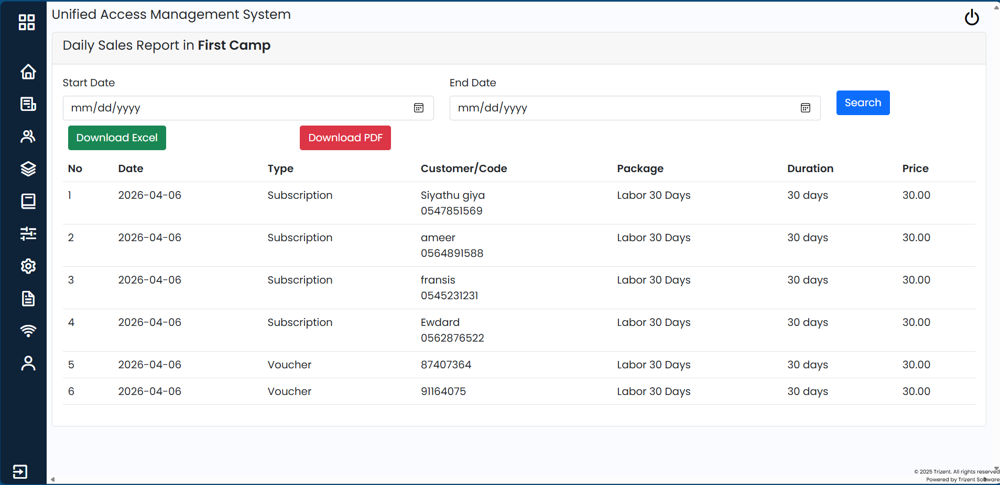

# OneCode – Advanced ISP Management System

**OneCode** is a comprehensive Internet Access Management System built using Laravel and Blade, designed for managing both registered and temporary users in shared environments such as labor camps.

It extends traditional ISP systems by supporting **both subscription-based access and voucher-based access**, providing flexibility for long-term and short-term users.

---

## Overview

OneCode enables seamless internet access management by integrating with MikroTik RouterOS API, allowing administrators to control hotspot users, manage packages, and automate access handling.

The system is built to handle:

- Registered users with subscriptions  
- Temporary users with voucher-based access  
- Automated session and expiry management  
- Flexible package and pricing configurations  

---

## Key Features

### Customer Subscription System
- Registered users can subscribe to internet packages  
- Each user has a personal profile  
- View active packages and expiry dates  
- QR code generation for faster login and purchase  

### Voucher System (For Temporary Users)
- Non-registered users can purchase vouchers  
- Unique **8-digit voucher codes** generated per purchase  
- Voucher validity: **3 months**  
- Ideal for short-term users  

### Unified Access Management
- Supports both:
  - Subscription-based access  
  - Voucher-based access  
- Managed using **polymorphic relationships** in Laravel  
- Access plans can be:
  - Transferred  
  - Edited  
  - Cancelled  

### MikroTik Integration
- Integrated with **RouterOS API**  
- Automatically creates and manages hotspot users  
- Controls bandwidth and access based on package  

### Automated Expiry Handling
- Cron job for:
  - Expired users  
  - Active session cleanup  
- Ensures system stays up-to-date without manual work  

### Flexible Package Management
- Create packages with:
  - Any number of days (5, 20, 30, etc.)  
  - Custom pricing  
- Assign packages based on user categories:
  - Labor  
  - Cleaner  
  - Staff  
  - Security  

### Dual Login System
- Customer login (registered users)  
- Voucher login (temporary users)  
- Unified login interface  

### QR Code Integration
- Registered users can generate QR codes  
- Faster login and subscription purchase  
- Improved user experience  

---

## Tech Stack

- **Backend:** Laravel  
- **Frontend:** Blade, Bootstrap CSS  
- **Database:** MySQL  
- **Integration:** MikroTik RouterOS API  
- **Architecture:** MVC + Polymorphic Relationships  
- **Automation:** Laravel Scheduler (Cron Jobs)  

---

## System Architecture Highlights

- Polymorphic relationships to unify subscriptions & vouchers  
- API-driven communication with MikroTik  
- Scheduled jobs for automated cleanup  
- Modular package and role-based system  

---

## Screenshots

  
  

  
  

  
  

  
  

--- 

## Installation Guide

1. Clone the repository

    git clone https://github.com/Chinthana144/OneCode.git
    cd onecode

2. Install dependencies

    composer install
    npm install
    npm run build

3. Environment setup

    cp .env.example .env
    php artisan key:generate

Update .env with:
- Database credentials
- MikroTik API credentials
- App URL

4. Run migrations with seeder

    Run migrations --seed

5. Start development server

    php artisan serve

6. Run scheduler (for cron jobs)

    php artisan schedule:work

cron job may run in hostinger add cron job with command

    public_html/cloudtik/artisan subscriptions:check-expired

adjust the loop time depending on the requirement (15 min)

---

## Mikrotik Configuration

1. Copy the hotspot folder content to the Mikrotik files/hotspot folder
2. Change the login.html file inputs
    - Camp id
    - Form submit URl (host url)
3. add Walled Garden rule for host website

--- 

## Future Improvements
- Online payment integration
- Mobile application support
- Real-time usage analytics
- Notification system (SMS / WhatsApp)
- Multi-language support

--- 

## Connect with me
- LinkedIn: *www.linkedin.com/in/chinthana-edirisinghe-42399321a*
- Email: *chinthana144@gmail.com* 

Thanks for visiting my profile!