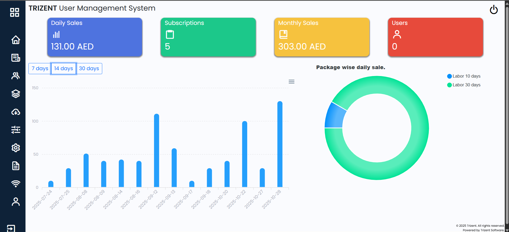
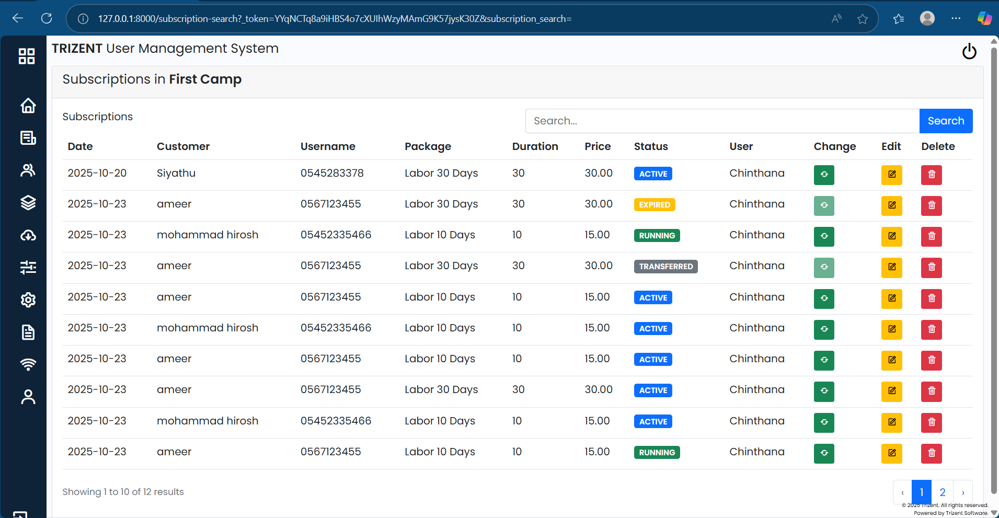
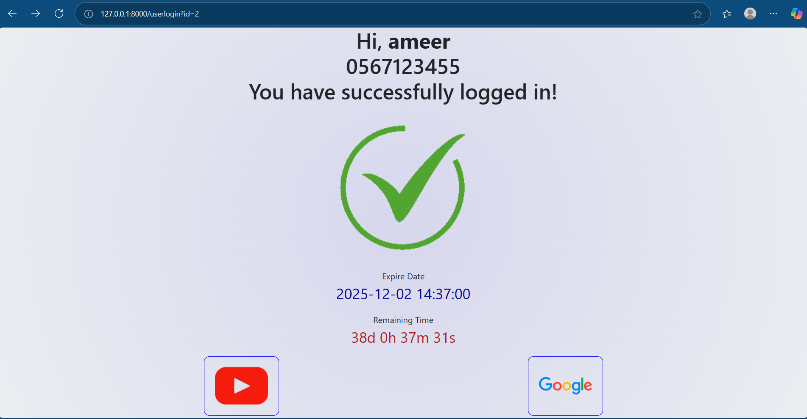

<<<<<<< HEAD
<<<<<<< HEAD
<<<<<<< HEAD
# CloudTik
Cloud network controller
=======
=======
>>>>>>> c73bcf2561c5b01d6e7f5c3e35b3c9272024f4cd

## About Laravel

Laravel is a web application framework with expressive, elegant syntax. We believe development must be an enjoyable and creative experience to be truly fulfilling. Laravel takes the pain out of development by easing common tasks used in many web projects, such as:

- [Simple, fast routing engine](https://laravel.com/docs/routing).
- [Powerful dependency injection container](https://laravel.com/docs/container).
- Multiple back-ends for [session](https://laravel.com/docs/session) and [cache](https://laravel.com/docs/cache) storage.
- Expressive, intuitive [database ORM](https://laravel.com/docs/eloquent).
- Database agnostic [schema migrations](https://laravel.com/docs/migrations).
- [Robust background job processing](https://laravel.com/docs/queues).
- [Real-time event broadcasting](https://laravel.com/docs/broadcasting).

Laravel is accessible, powerful, and provides tools required for large, robust applications.

## Learning Laravel

Laravel has the most extensive and thorough [documentation](https://laravel.com/docs) and video tutorial library of all modern web application frameworks, making it a breeze to get started with the framework.

You may also try the [Laravel Bootcamp](https://bootcamp.laravel.com), where you will be guided through building a modern Laravel application from scratch.

If you don't feel like reading, [Laracasts](https://laracasts.com) can help. Laracasts contains thousands of video tutorials on a range of topics including Laravel, modern PHP, unit testing, and JavaScript. Boost your skills by digging into our comprehensive video library.

## Laravel Sponsors

We would like to extend our thanks to the following sponsors for funding Laravel development. If you are interested in becoming a sponsor, please visit the [Laravel Partners program](https://partners.laravel.com).

### Premium Partners

- **[Vehikl](https://vehikl.com/)**
- **[Tighten Co.](https://tighten.co)**
- **[WebReinvent](https://webreinvent.com/)**
- **[Kirschbaum Development Group](https://kirschbaumdevelopment.com)**
- **[64 Robots](https://64robots.com)**
- **[Curotec](https://www.curotec.com/services/technologies/laravel/)**
- **[Cyber-Duck](https://cyber-duck.co.uk)**
- **[DevSquad](https://devsquad.com/hire-laravel-developers)**
- **[Jump24](https://jump24.co.uk)**
- **[Redberry](https://redberry.international/laravel/)**
- **[Active Logic](https://activelogic.com)**
- **[byte5](https://byte5.de)**
- **[OP.GG](https://op.gg)**

## Contributing

Thank you for considering contributing to the Laravel framework! The contribution guide can be found in the [Laravel documentation](https://laravel.com/docs/contributions).

## Code of Conduct

In order to ensure that the Laravel community is welcoming to all, please review and abide by the [Code of Conduct](https://laravel.com/docs/contributions#code-of-conduct).

## Security Vulnerabilities

If you discover a security vulnerability within Laravel, please send an e-mail to Taylor Otwell via [taylor@laravel.com](mailto:taylor@laravel.com). All security vulnerabilities will be promptly addressed.

## License

The Laravel framework is open-sourced software licensed under the [MIT license](https://opensource.org/licenses/MIT).
<<<<<<< HEAD
>>>>>>> chinthana_dev
=======
## \## CloudTik – ISP Management System (Web Application)

## CloudTik is a full-featured Internet Service Provider (ISP) Management System designed for labor camps and shared internet environments.

## The system supports customer registration, subscription management, invoicing, MikroTik integration, and multi-camp operations.

## 

## \## Features

## \### Customer Management

## &nbsp;- Create, edit, and manage customers

## &nbsp;- Track device MAC addresses

## &nbsp;- Customer activity logs

## &nbsp;- Account status \& expiry tracking

## 

## \### Subscription \& Package Management

## &nbsp;- Create customizable packages (any number of days + price)

## &nbsp;- Categorize packages by customer type

## &nbsp;- Subscription renewal and recharge

## &nbsp;- View active, upcoming, and expired subscriptions

## 

## \### Invoice \& Payment System

## &nbsp;- Web-based invoice creation

## &nbsp;- Supports voucher and subscription invoices

## &nbsp;- Customer invoice history

## &nbsp;- Integrated with mobile application (CloudTik Sales)

## 

## \### MikroTik Integration

## &nbsp;- RouterOS API integration

## &nbsp;- Automatic hotspot user creation

## &nbsp;- MAC binding

## &nbsp;- Session login tracking

## 

## \### Multi-Camp Support

## &nbsp;- Manage different labor camps

## &nbsp;- Assign customers to camps

## &nbsp;- Camp-level reports

## &nbsp;- Camp-level package configuration

## 

## \### User Access Control

## &nbsp;- Role-based permissions \& gate policies

## &nbsp;- Admin, Manager, Salesperson roles

## &nbsp;- Access controlled by designation

## 

## \### Dashboard \& Reports

## &nbsp;- Daily/weekly/monthly sales

## &nbsp;- Active customers

## &nbsp;- Upcoming expiries

## &nbsp;- Package-based statistics

## 

## \## Tech Stack

## \- \*\*Backend:\*\* Laravel 10

## \- \*\*Frontend:\*\* Blade, jQuery, Bootstrap

## \- \*\*Database:\*\* MySQL

## \- \*\*API Integration:\*\* MikroTik RouterOS API

## \- \*\*Auth:\*\* Laravel Breeze / Sanctum

## \- \*\*Other Tools:\*\* Postman

## 

## \## Connected Mobile Application

## The CloudTik Sales mobile app (Flutter) integrates with this backend to allow sales teams to:

## &nbsp;- Register customers

## &nbsp;- Create subscriptions

## &nbsp;- Reset MAC address

## &nbsp;- View sales performance

## (Separate README will cover the mobile app.)

## 

## \## Screenshots

## !\[Dashboard](screenshots/dashboard.png)

## !\[Customer List](screenshots/subscriptions.png)

## !\[Invoice Page](screenshots/logged.png)

## 

## \## Installation Guide

## Follow the steps below to install and run the CloudTik web application on your local environment.

## 

## \### Clone the Repository

## &nbsp;   git clone https://github.com/your-username/CloudTik.git

## &nbsp;   cd CloudTik

## 

## \### Install PHP Dependencies

## &nbsp;   composer install

## 

## \### Install Frontend Dependencies

## &nbsp;   npm install

## &nbsp;   npm run build

## (Or use npm run dev during development.)

## 

## \### Environment Setup

## Copy the example environment file:

## 

## &nbsp;   cp .env.example .env

## 

## Generate application key:

## 

## &nbsp;   php artisan key:generate

## 

## Now update your .env file with:

## \- \*\*Database credentials\*\*

## \- \*\*MikroTik API settings\*\*

## \- \*\*Stripe keys (if using payments)\*\*

## \- \*\*APP\_URL\*\*

## 

## \## Run Migrations

## &nbsp;   php artisan migrate

## 

## \*\*Note: After migration is completed run the 'initialize.sql' file in database to initialize settings and access\*\*

## 

## \## Start the Development Server

## &nbsp;   php artisan serve

## 

## The CloudTik web system should now be running locally.

## 

## \## Deployment Instructions for cloud

## &nbsp;- add the files in hotspot folder to the files in Mikrotik (login is executed by API, change the API link in login.html as necessary)

## &nbsp;- add Walled Garden rule to Mikrotik depending on the hosting domain.

## &nbsp;- add schedule to hosting platform to execute expired users, \*\*subscriptions:check-expired\*\*

## 

## \## Future Improvements

## &nbsp;- Implement voucher issue for none registered customers

## &nbsp;- Advanced analytics and reporting

## &nbsp;- Auto-expiry notifications via WhatsApp / SMS

## &nbsp;- Complete multi-language support

## &nbsp;- More detailed hotspot user analytics

## 

## \## Connect with me  

## \- LinkedIn: \*www.linkedin.com/in/chinthana-edirisinghe-42399321a\*  

## \- Email: \*chinthana144@gmail.com\*  

## 

## Thanks for visiting my profile!

<<<<<<< HEAD
=======
### Subscription & Package Management
 - Create customizable packages (any number of days + price)
 - Categorize packages by customer type
 - Subscription renewal and recharge
 - View active, upcoming, and expired subscriptions

### Invoice & Payment System
 - Web-based invoice creation
 - Supports voucher and subscription invoices
 - Customer invoice history
 - Integrated with mobile application (CloudTik Sales)

### MikroTik Integration
 - RouterOS API integration
 - Automatic hotspot user creation
 - MAC binding
 - Session login tracking

### Multi-Camp Support
 - Manage different labor camps
 - Assign customers to camps
 - Camp-level reports
 - Camp-level package configuration

### User Access Control
 - Role-based permissions & gate policies
 - Admin, Manager, Salesperson roles
 - Access controlled by designation

### Dashboard & Reports
 - Daily/weekly/monthly sales
 - Active customers
 - Upcoming expiries
 - Package-based statistics

## Tech Stack
- **Backend:** Laravel 10
- **Frontend:** Blade, jQuery, Bootstrap
- **Database:** MySQL
- **API Integration:** MikroTik RouterOS API
- **Auth:** Laravel Breeze / Sanctum
- **Other Tools:** Postman

## Connected Mobile Application
The CloudTik Sales mobile app (Flutter) integrates with this backend to allow sales teams to:
 - Register customers
 - Create subscriptions
 - Reset MAC address
 - View sales performance
(Separate README will cover the mobile app.)

## Screenshots

## Installation Guide
Follow the steps below to install and run the CloudTik web application on your local environment.

### Clone the Repository
    git clone https://github.com/your-username/CloudTik.git
    cd CloudTik

### Install PHP Dependencies
    composer install

### Install Frontend Dependencies
    npm install
    npm run build
(Or use npm run dev during development.)

### Environment Setup
Copy the example environment file:

    cp .env.example .env

Generate application key:

    php artisan key:generate

Now update your .env file with:
- **Database credentials**
- **MikroTik API settings**
- **Stripe keys (if using payments)**
- **APP_URL**

## Run Migrations
    php artisan migrate

**Note: After migration is completed run the 'initialize.sql' file in database to initialize settings and access**

## Start the Development Server
    php artisan serve

The CloudTik web system should now be running locally.

## Deployment Instructions for cloud
 - add the files in hotspot folder to the files in Mikrotik (login is executed by API, change the API link in login.html as necessary)
 - add Walled Garden rule to Mikrotik depending on the hosting domain.
 - add schedule to hosting platform to execute expired users, **subscriptions:check-expired**

## Future Improvements
 - Implement voucher issue for none registered customers
 - Advanced analytics and reporting
 - Auto-expiry notifications via WhatsApp / SMS
 - Complete multi-language support
 - More detailed hotspot user analytics

## Connect with me  
- LinkedIn: *www.linkedin.com/in/chinthana-edirisinghe-42399321a*  
- Email: *chinthana144@gmail.com*  

Thanks for visiting my profile!
>>>>>>> b2d29c2da96312753a514935a4062d93d73441b5
>>>>>>> chinthana_dev
=======
>>>>>>> c73bcf2561c5b01d6e7f5c3e35b3c9272024f4cd
